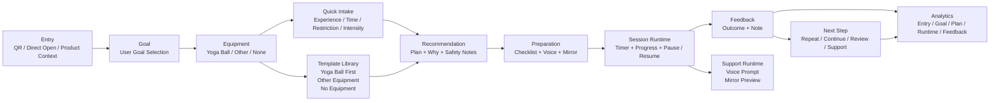

# 阶段三 MVP 总体架构图

## 1. 目的

本文件用于承接“阶段三 MVP 总体架构图”，供内部汇报、产品评审、研发对齐使用。  
该内容属于项目文档，不属于终端用户在 App 内看到的产品内容。

## 2. 总体架构图

## 3. 模块说明

- `Entry`：承接扫码或直接打开，保留产品上下文，但不强制进入旧教程路径。
- `Goal`：先问用户今天要解决什么问题，而不是先看产品说明。
- `Equipment`：支持瑜伽球优先，同时保留其他器材和无器材路径。
- `Quick Intake`：收集最少但关键的状态信息。
- `Recommendation`：输出结构化首训方案。
- `Preparation`：放训练前提醒和运行时开关。
- `Session Runtime`：承接真实跟练过程。
- `Feedback`：收集完成情况和体感。
- `Next Step`：把反馈转成继续动作，而不是让用户自己判断下一步。

## 4. 说明

- 这份架构图是内部沟通资产。
- App 内应只保留用户训练所需的信息，不应展示该架构图或项目实施节奏。
