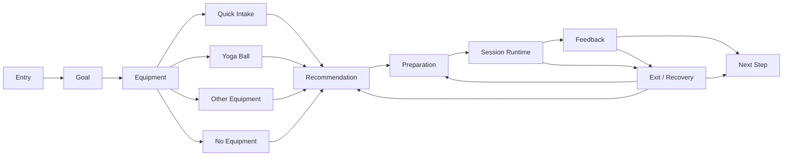
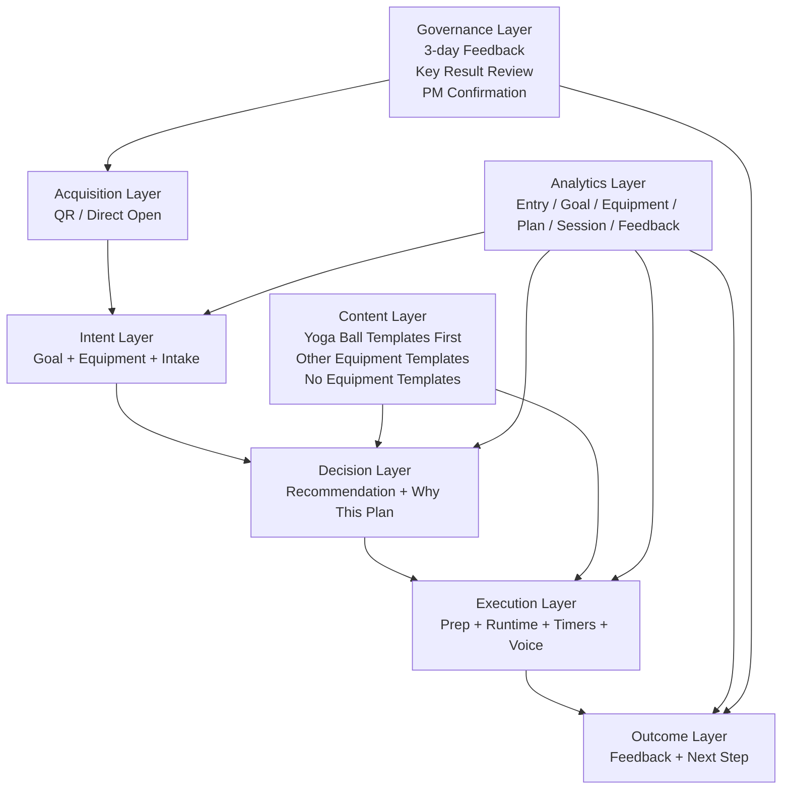

# Stage 3 MVP Overall Architecture

## Journey View

## Layer View

## Page Responsibility Summary

| Page | Main job | Minimum output |
|---|---|---|
| Entry | Start the MVP with confidence | User chooses to begin |
| Goal | Capture training intent | One selected goal |
| Equipment | Capture available setup | One or more equipment selections, including yoga ball / other / none |
| Quick Intake | Capture minimum context | Experience, time, restriction, intensity preference |
| Recommendation | Present suggested session | Start decision |
| Preparation | Prepare user and runtime options | Ready-to-start state |
| Session Runtime | Guide execution | Step progression and completion/exit state |
| Feedback | Capture result | Session outcome |
| Next Step | Route forward | Repeat / continue / prep review / support |
