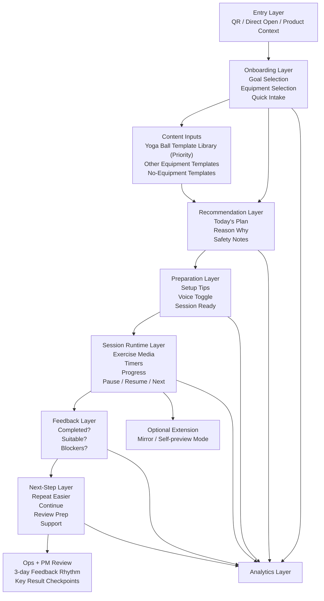

## Context

The current repository still ships a Stage 2 shell that renders HTML mockups for a fixed tutorial journey: landing, step1, step2, step3, feedback, and unresolved follow-up. That shell is useful as a proof of deployment, navigation bridging, and local event collection, but it is the wrong top-level model for Stage 3. The updated product direction is a goal-driven training assistant that must support direct entry or scan entry, multi-equipment selection, rules-based recommendation, a training runtime, and post-session recovery.

Stage 3 also has tighter execution constraints than the earlier planning assumed:

- The delivery window should be compressed to 2-3 weeks.
- Yoga-ball training templates should be the first deeply prepared content library because the hardware business priority is yoga-ball aligned.
- The product must still support other equipment and no-equipment paths in onboarding.
- Product and engineering progress must be reviewed every 3 days, with an additional review at each key result checkpoint, so scope drift is caught early.

This change defines the front-end contract needed before implementation starts.

## Goals / Non-Goals

**Goals:**
- Define the new Stage 3 MVP front-end shell as a page-based goal-driven flow instead of a tutorial-first flow.
- Freeze the minimum page sequence, branching logic, CTA states, and recovery behavior needed to start implementation.
- Define how onboarding, recommendation, preparation, session runtime, and feedback fit together in one coherent PWA shell.
- Prioritize yoga-ball template integration without collapsing the onboarding model into a yoga-ball-only product.
- Provide a visual architecture diagram that aligns product, engineering, analytics, and content stakeholders.
- Support a 2-3 week implementation plan and a 3-day feedback cadence.

**Non-Goals:**
- Implementing the UI in this change.
- Designing final visual styling for every Stage 3 page.
- Introducing native-app-only behavior or advanced motion recognition.
- Turning the MVP into a yoga-ball-only product flow.

## Decisions

### Decision 1: Replace the tutorial-first route model with a state-driven MVP journey

The Stage 3 shell should replace the current `landing -> step1 -> step2 -> step3 -> feedback -> unresolved` route map with a goal-driven route map:

`entry -> goal -> equipment -> intake -> recommendation -> prep -> session -> feedback -> next-step`

Rationale:
- The updated product value starts with user intent, not with tutorial steps.
- This route map directly mirrors the Stage 3 MVP definition and supports real usage validation.

Alternatives considered:
- Keep the tutorial route map and patch training screens on top of it: rejected because it preserves the wrong mental model.
- Skip pages and use one long form: rejected because it weakens pacing, clarity, and checkpoint analytics.

### Decision 2: Treat the front-end as five functional modules, not nine unrelated pages

The implementation should group screens into five modules:

1. Entry and context capture
2. Onboarding and intent capture
3. Recommendation and prep
4. Session runtime
5. Feedback and recovery

This keeps the page count understandable while still allowing individual screens inside each module.

Alternatives considered:
- One page per action with very granular routing: rejected because it creates excessive navigation overhead.
- A single mega-screen: rejected because state complexity and analytics become harder to reason about.

### Decision 3: Use yoga-ball-first content seeding inside an equipment-agnostic flow

The equipment selector will include yoga ball, other supported equipment, and no-equipment choices. Recommendation logic will seed its first deeply prepared content templates around yoga-ball scenarios, but the onboarding flow will remain equipment-agnostic.

Rationale:
- It supports immediate collaboration with the yoga-ball product operations team.
- It avoids product drift into a single-SKU or single-equipment experience.

Alternatives considered:
- Restrict Stage 3 entirely to yoga-ball users: rejected because it breaks the broader product positioning.
- Avoid any equipment prioritization: rejected because it would slow down content readiness and stakeholder coordination.

### Decision 4: Keep timers, voice, and recovery inside the first implementation slice

The Stage 3 runtime shell will include timer behavior, voice-prompt enablement, feedback capture, and recovery paths in the first build slice. These are not optional polish items; they are core to validating whether users can complete a session with confidence.

Alternatives considered:
- Start with recommendation pages only, add runtime later: rejected because it does not validate the real product value.
- Hide recovery paths until a later version: rejected because unresolved user states are part of the MVP loop.

### Decision 5: Keep mirror mode as a reserved extension point, not a hard blocker

The architecture will reserve a session-level extension point for mirror/self-preview mode, but Stage 3 implementation can ship the standard session runtime first if time pressure requires sequencing.

Rationale:
- Mirror mode remains strategically important.
- It should not block the 2-3 week delivery target for the first working shell.

### Decision 6: Formalize 3-day feedback checkpoints in the delivery design

The implementation plan should assume:

- progress feedback every 3 days,
- a key-result review whenever a major slice is completed,
- checkpoint confirmation with项目经理田楚 before moving from flow freeze to implementation, and from implementation to validation.

This is part of the delivery design because Stage 3 risk is primarily scope drift, not technical impossibility.

## Visual Architecture

## Page and Function Model

The implementation will treat the MVP shell as the following screen contract:

| Screen | Primary purpose | Core functions |
|---|---|---|
| Entry | Start the product with confidence | Start CTA, retain scan context, explain value |
| Goal | Capture intent | Single-select goal, show supported paths |
| Equipment | Capture available setup | Multi-select equipment, include yoga ball, include no equipment |
| Intake | Capture minimum context | Experience, time, restriction/discomfort, intensity preference |
| Recommendation | Present the proposed first session | Plan summary, safety notes, recommendation explanation, start CTA |
| Prep | Prepare the user | Setup guidance, prep checklist, voice toggle, optional mirror placeholder |
| Session | Execute the session | Media, progress, timers, pause/resume, next, exit handling |
| Feedback | Capture session result | Completion, suitability, blocker, note |
| Next Step | Route the user forward | Repeat easier, continue, review prep, support |

## Risks / Trade-offs

- [The compressed 2-3 week window may tempt the team to skip flow definition] -> Freeze route and page contracts before implementation begins.
- [Yoga-ball-first content could be misread as a yoga-ball-only product] -> Keep equipment selection broad and state the distinction explicitly in onboarding and requirements.
- [Rebuilding the shell may invalidate parts of the Stage 2 navigation bridge] -> Reuse only the deployable PWA scaffolding and replace the route/state map cleanly.
- [Timers, voice, and recovery add complexity to the first slice] -> Keep recommendation logic deterministic and defer mirror mode implementation if needed.
- [Too many progress reviews could slow execution] -> Use 3-day checkpoints as lightweight structured demos rather than full report cycles.

## Migration Plan

1. Freeze the Stage 3 route map, page contract, and analytics checkpoints from this change.
2. Create the new Stage 3 front-end shell in the current PWA app, replacing tutorial-first route state with MVP route state.
3. Seed yoga-ball templates first, while keeping the selector and recommendation model open to other equipment and no-equipment combinations.
4. Implement the first working runtime with timers, voice toggle, feedback, and next-step handling.
5. Review results every 3 days and at each key slice completion before advancing to small-scale validation.

## Open Questions

- Which three yoga-ball scenarios should be the first deep templates for launch?
- Should no-equipment recommendations appear in the first recommendation set or only as a fallback?
- Will mirror mode be shipped in the same implementation slice or as a follow-on slice inside the same Stage 3 window?
- Which analytics sink should replace local storage before external testing begins?
